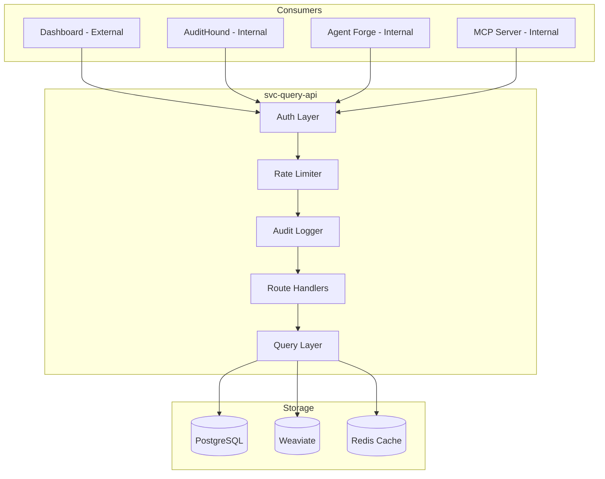

Status: Tier-1 Stub  
Owner: Data Pipeline Engineering  
Approvers: Architecture Board, Security Engineering  
Last updated: 2025-11-26  
Applies to: services/nc-data-pipeline/src/api/ (svc-query-api)  
Related: ARC-001, DCON-001, DM-003, SEC-001, SEC-002, REF-001, REF-002

-----

## 1. Purpose

This document defines the architecture of svc-query-api, the query layer that
exposes security findings, assets, and analytics to internal modules and
external consumers.

It exists to:

- Specify the public and internal API surface of the data pipeline.
- Define authentication, authorization, and tenant isolation.
- Establish query patterns, pagination, and filtering.
- Map API contracts to underlying data stores.

-----

## 2. Scope

This document covers:

- svc-query-api boundaries and responsibilities.
- REST endpoint design (per REF-001 §10).
- Authentication and authorization (JWT, API keys).
- Tenant isolation and row level security.
- Query optimization and caching.

This document does not cover:

- Ingestion endpoints (see DPS-ING-001).
- Data normalization (see DPS-NORM-001).
- Module specific APIs (AuditHound, Agent Forge have their own).

-----

## 3. References

- REF-001 Glossary and Standards Catalog (§4 Naming, §10 API Standards, §12 Observability)
- REF-002 Platform Constants
- DCON-001 Data Contract Specification
- DM-003 Physical Schemas and Storage Map
- SEC-002 IAM Policy and Trust Relationship Map

-----

## 4. Service context



-----

## 5. API design principles (per REF-001 §10)

|Principle       |Implementation                                 |
|----------------|-----------------------------------------------|
|Tenant isolation|All queries scoped by tenant_id from JWT       |
|Least privilege |Role based access (viewer, operator, admin)    |
|Pagination      |Cursor based via next_cursor (REF-001 §10.1)   |
|Errors          |RFC 7807 Problem Details (REF-001 §10.2)       |
|Idempotency     |Idempotency-Key header for POST (REF-001 §10.3)|
|Versioning      |URL versioning /v1 (REF-001 §4.3)              |

-----

## 6. Core endpoints

Base path: `/v1` (per REF-001 §4.3, REF-002)

|Endpoint                   |Method|Description                    |Auth|
|---------------------------|------|-------------------------------|----|
|`/v1/findings`             |GET   |List security findings         |JWT |
|`/v1/findings/{finding_id}`|GET   |Get finding detail             |JWT |
|`/v1/assets`               |GET   |List cloud assets              |JWT |
|`/v1/assets/{asset_id}`    |GET   |Get asset detail               |JWT |
|`/v1/events`               |GET   |List security events           |JWT |
|`/v1/compliance/status`    |GET   |Compliance posture summary     |JWT |
|`/v1/analytics/summary`    |GET   |Dashboard metrics              |JWT |
|`/v1/search`               |POST  |Semantic search across entities|JWT |

Resource paths use kebab case nouns (REF-001 §4.3).

Full OpenAPI spec: `services/nc-data-pipeline/openapi.yaml`

-----

## 7. Authentication and authorization

### 7.1 Authentication methods

|Method       |Use Case                  |Token Location      |
|-------------|--------------------------|--------------------|
|JWT (OAuth2) |Dashboard, UI clients     |Authorization header|
|API Key      |Service to service, CLI   |X-API-Key header    |
|Internal mTLS|Inter module communication|Client certificate  |

### 7.2 Authorization model

```python
class Role(str, Enum):
    VIEWER = "viewer"      # Read findings, assets
    OPERATOR = "operator"  # Plus acknowledge, trigger remediation
    ADMIN = "admin"        # Plus configure, manage users

PERMISSIONS = {
    "viewer": ["findings:read", "assets:read", "events:read"],
    "operator": ["findings:*", "assets:read", "remediation:trigger"],
    "admin": ["*"],
}
```

### 7.3 Tenant isolation

- JWT contains tenant_id claim.
- All database queries include `WHERE tenant_id = :tenant_id`.
- PostgreSQL RLS policies enforce isolation at database level (DM-003).

-----

## 8. Query patterns (per REF-001 §10.1)

### 8.1 Filtering

```
GET /v1/findings?severity=HIGH&source=AWS_GUARDDUTY&created_after=2025-01-01
```

JSON fields use snake_case (REF-001 §4.3).

### 8.2 Cursor pagination

```json
{
  "data": [],
  "pagination": {
    "next_cursor": "eyJpZCI6MTIzfQ==",
    "has_more": true
  }
}
```

### 8.3 Semantic search

```
POST /v1/search
Headers:
  Idempotency-Key: 018fa0b8-6cde-7d2a-bd7f-8d9a3f6f1d0a

{
  "query": "S3 buckets with public access",
  "entity_types": ["finding", "asset"],
  "limit": 20
}
```

Uses Weaviate vector search.

-----

## 9. Error responses (per REF-001 §10.2)

All errors follow RFC 7807 Problem Details:

```json
{
  "type": "https://docs.neurocipher.io/errors/not-found",
  "title": "Not Found",
  "status": 404,
  "detail": "Finding with id 018fa0b8 not found",
  "instance": "/v1/findings/018fa0b8"
}
```

Content type: `application/problem+json`

-----

## 10. Rate limiting (per REF-001 §10.1)

|Consumer Type       |Limit    |Window|
|--------------------|---------|------|
|Dashboard (per user)|100 req  |1 min |
|API Key (per key)   |1000 req |1 min |
|Internal service    |Unlimited|N/A   |

Rate limit headers:

- `X-RateLimit-Limit`
- `X-RateLimit-Remaining`
- `X-RateLimit-Reset`

-----

## 11. Caching strategy

|Data Type        |Cache TTL|Invalidation     |
|-----------------|---------|-----------------|
|Finding counts   |60s      |On new finding   |
|Asset inventory  |300s     |On ingest        |
|Compliance status|300s     |On finding change|
|User preferences |3600s    |On user update   |

Cache layer: Redis (see DM-003).

-----

## 12. Observability (per REF-001 §12)

### 12.1 Logs

JSON structured logs with required keys:

```json
{
  "ts": "2025-11-26T18:00:00Z",
  "level": "INFO",
  "svc": "svc-query-api",
  "env": "prod",
  "adr_id": "ADR-0001",
  "release": "v0.1.0",
  "trace_id": "abc123",
  "span_id": "def456",
  "msg": "Request processed",
  "tenant_id": "tenant_abc123",
  "endpoint": "/v1/findings",
  "status_code": 200,
  "latency_ms": 45
}
```

### 12.2 Metrics

Naming per REF-001 §12.2: `svc.query.api.{metric}`

- `svc.query.api.requests_total` (counter)
- `svc.query.api.latency_seconds` (histogram)
- `svc.query.api.errors_total` (counter by status code)
- `svc.query.api.cache_hit_ratio` (gauge)

### 12.3 Tracing

W3C Trace Context propagation (REF-001 §12.3):

- Propagate `traceparent` and `tracestate` headers.

-----

## 13. Required resource tags (per REF-002)

```json
{
  "Project": "Neurocipher",
  "Service": "svc-query-api",
  "Env": "prod",
  "Owner": "team-platform",
  "Compliance": "SOX|GDPR",
  "DataClass": "Confidential"
}
```

-----

## 14. Acceptance criteria

This document is complete when:

- [ ] All core endpoints are defined with request and response schemas.
- [ ] OpenAPI spec is generated and matches this document.
- [ ] Auth model is validated against SEC-002.
- [ ] Tenant isolation is tested with multi tenant scenarios.
- [ ] Rate limiting is implemented and tested.
- [ ] Errors follow RFC 7807 (REF-001 §10.2).
- [ ] Pagination uses cursor based approach (REF-001 §10.1).
- [ ] Logs include all required keys (REF-001 §12.1).
- [ ] Service name matches REF-002 constants.

-----

## 15. Open questions

- [ ] Confirm GraphQL is not needed for MVP (REST only per REF-001 §10.1).
- [ ] Define SLA for API response times (p95 less than 200ms).
- [ ] Define cross tenant query model for admin users.

-----

## 16. Revision history

|Date      |Author                   |Change             |
|----------|-------------------------|-------------------|
|2025-11-26|Data Pipeline Engineering|Initial Tier-1 stub|