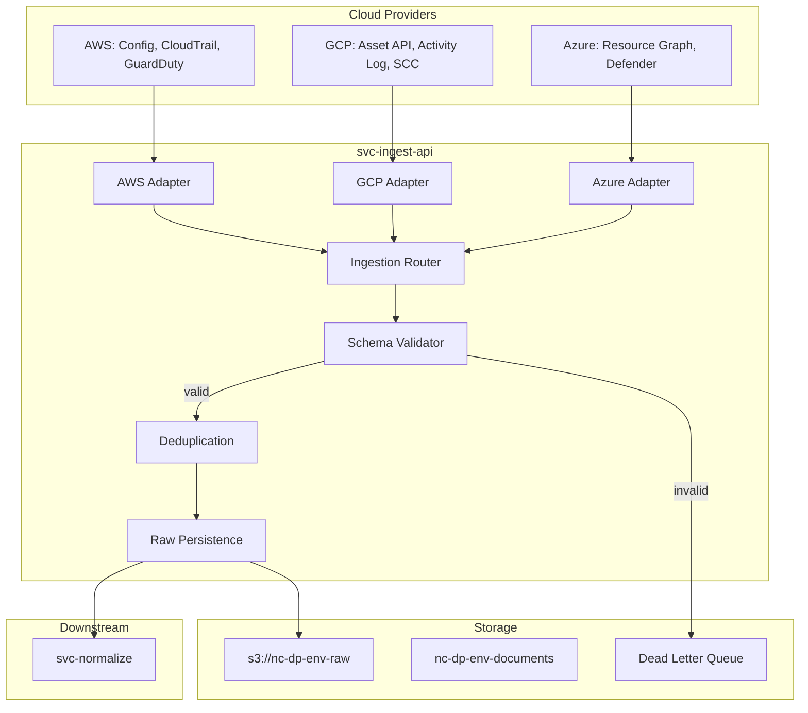

Status: Tier-1 Stub  
Owner: Data Pipeline Engineering  
Approvers: Architecture Board, Security Engineering  
Last updated: 2025-11-26  
Applies to: services/nc-data-pipeline/src/ingest/ (svc-ingest-api)  
Related: ARC-001, ING-002, ING-003, DCON-001, DM-003, SEC-001, REF-001, REF-002

-----

## 1. Purpose

This document defines the architecture of svc-ingest-api, the entry point
for all external data into the Neurocipher platform.

It exists to:

- Specify how data flows from cloud providers into the platform.
- Define the ingestion interfaces, protocols, and guarantees.
- Establish reliability, ordering, and deduplication requirements.
- Map to the broader data pipeline architecture.

-----

## 2. Scope

This document covers:

- svc-ingest-api boundaries and responsibilities.
- Supported ingestion modes (push, pull, streaming).
- Source adapters for AWS, GCP, Azure.
- Raw data persistence and handoff to svc-normalize.
- Error handling, dead letter queues, and retry logic.

This document does not cover:

- Normalization logic (see DPS-NORM-001).
- API query endpoints (see DPS-API-001).
- Source adapter implementation details (see ING-002).

-----

## 3. References

- REF-001 Glossary and Standards Catalog
- REF-002 Platform Constants
- ING-002 Source Adapters and Connectors
- ING-003 Enrichment Routing and Persistence
- DCON-001 Data Contract Specification
- SEC-001 Threat Model and Mitigation Matrix

-----

## 4. Service context



-----

## 5. Ingestion modes

|Mode          |Use Case                                 |Protocol           |Latency      |
|--------------|-----------------------------------------|-------------------|-------------|
|Push (Webhook)|Real time events (GuardDuty, EventBridge)|HTTPS POST         |Less than 1s |
|Pull (Polling)|Config snapshots, batch exports          |Cloud SDK          |5 to 15 min  |
|Streaming     |CloudTrail via Kinesis or Pub/Sub        |Cloud streaming SDK|Less than 30s|

-----

## 6. Source adapters

|Adapter               |Data Sources                        |Ingestion Mode    |Priority|
|----------------------|------------------------------------|------------------|--------|
|`aws_config`          |AWS Config rules, resource inventory|Pull              |P0 (MVP)|
|`aws_cloudtrail`      |API activity logs                   |Streaming or Pull |P0 (MVP)|
|`aws_guardduty`       |Threat findings                     |Push (EventBridge)|P1      |
|`aws_security_hub`    |Aggregated findings                 |Push or Pull      |P1      |
|`gcp_asset`           |Resource inventory                  |Pull              |P2      |
|`gcp_scc`             |Security findings                   |Push (Pub/Sub)    |P2      |
|`azure_resource_graph`|Resource inventory                  |Pull              |P2      |
|`azure_defender`      |Security findings                   |Push (Event Grid) |P2      |

Detailed adapter specifications in ING-002.

-----

## 7. Data flow

1. Receive: Adapter receives data from cloud provider.
2. Validate: Schema validation against DCON-001 contracts.
3. Identify tenant: Extract tenant_id from credentials or metadata.
4. Deduplicate: Check against recent event cache (Redis, 24 hour window).
5. Persist raw: Write to `s3://nc-dp-{env}-raw` with encryption via `alias/nc-dp-data-{env}`.
6. Enqueue: Publish CloudEvents message to svc-normalize queue.
7. Acknowledge: Return success to source (for push mode).

-----

## 8. Storage (per REF-002)

|Type          |Location               |Encryption              |
|--------------|-----------------------|------------------------|
|Raw events    |`s3://nc-dp-{env}-raw` |`alias/nc-dp-data-{env}`|
|Event metadata|`nc-dp-{env}-documents`|`alias/nc-dp-data-{env}`|
|Dead letter   |SQS DLQ                |`alias/nc-dp-data-{env}`|

-----

## 9. Reliability guarantees

|Guarantee             |Implementation                                          |
|----------------------|--------------------------------------------------------|
|At least once delivery|Idempotent processing, deduplication window             |
|No data loss          |Persist before acknowledge, dead letter queue           |
|Ordering              |Per resource ordering where possible, no global ordering|
|Backpressure          |Queue depth monitoring, rate limiting on adapters       |

-----

## 10. Error handling

|Error Type                |Handling                      |Destination             |
|--------------------------|------------------------------|------------------------|
|Schema validation failure |Log, reject                   |Dead letter queue       |
|Duplicate event           |Log, skip                     |None (already processed)|
|Transient cloud API error |Retry with exponential backoff|Retry queue             |
|Persistent cloud API error|Alert, circuit break          |Dead letter queue       |
|Tenant not found          |Log, reject                   |Dead letter queue       |

Errors follow RFC 7807 Problem Details (REF-001 §10.2):

```json
{
  "type": "https://docs.neurocipher.io/errors/validation-failed",
  "title": "Validation Failed",
  "status": 400,
  "detail": "Field resource_id is required",
  "instance": "/v1/ingest/webhook/aws_guardduty"
}
```

-----

## 11. Webhook endpoint (push mode)

```
POST /v1/ingest/webhook/{source_type}
Headers:
  X-Tenant-ID: {tenant_id}
  X-Signature: {hmac_signature}
  Idempotency-Key: {uuidv7}
Body: {source specific payload}

Response: 202 Accepted | 400 Bad Request | 401 Unauthorized
```

API path follows REF-001 §4.3: base path `/v1`, kebab case nouns.

-----

## 12. Queue message contract (CloudEvents 1.0)

Message published to svc-normalize queue per REF-001 §11:

```json
{
  "id": "018fa0b8-6cde-7d2a-bd7f-8d9a3f6f1d0a",
  "source": "svc.ingest.api",
  "type": "ingest.raw_event.received.v1",
  "specversion": "1.0",
  "time": "2025-11-26T18:00:00Z",
  "datacontenttype": "application/json",
  "data": {
    "message_id": "018fa0b8-6cde-7d2a-bd7f-8d9a3f6f1d0a",
    "tenant_id": "tenant_abc123",
    "source_type": "aws_guardduty",
    "raw_event_s3_key": "raw/2025/11/26/018fa0b8.json",
    "received_at": "2025-11-26T18:00:00Z"
  }
}
```

-----

## 13. Required resource tags (per REF-001 §6.1, REF-002)

```json
{
  "Project": "Neurocipher",
  "Service": "svc-ingest-api",
  "Env": "prod",
  "Owner": "team-platform",
  "Compliance": "SOX|GDPR",
  "DataClass": "Confidential",
  "PII": "true"
}
```

-----

## 14. Observability (per REF-001 §12)

### 14.1 Logs

JSON structured logs with required keys:

```json
{
  "ts": "2025-11-26T18:00:00Z",
  "level": "INFO",
  "svc": "svc-ingest-api",
  "env": "prod",
  "adr_id": "ADR-0001",
  "release": "v0.1.0",
  "trace_id": "abc123",
  "span_id": "def456",
  "msg": "Event ingested successfully",
  "tenant_id": "tenant_abc123",
  "source_type": "aws_guardduty"
}
```

### 14.2 Metrics

Naming per REF-001 §12.2: `svc.ingest.api.{metric}`

- `svc.ingest.api.events_received_total` (counter)
- `svc.ingest.api.events_rejected_total` (counter)
- `svc.ingest.api.latency_seconds` (histogram)
- `svc.ingest.api.queue_depth` (gauge)

-----

## 15. Acceptance criteria

This document is complete when:

- [ ] All supported sources are enumerated with ingestion mode.
- [ ] Data flow is validated against ING-003 enrichment spec.
- [ ] Error handling covers all failure modes in SEC-001 threat model.
- [ ] Queue contract matches CloudEvents 1.0 (REF-001 §11).
- [ ] At least AWS Config and CloudTrail adapters are implemented.
- [ ] Service name matches REF-002 constants.
- [ ] Storage locations match REF-002 constants.
- [ ] Logs include all required keys (REF-001 §12.1).

-----

## 16. Open questions

- [ ] Confirm deduplication window (1 hour or 24 hours).
- [ ] Define credential rotation strategy for pull mode adapters.
- [ ] Confirm dead letter queue retention period.

-----

## 17. Revision history

|Date      |Author                   |Change             |
|----------|-------------------------|-------------------|
|2025-11-26|Data Pipeline Engineering|Initial Tier-1 stub|