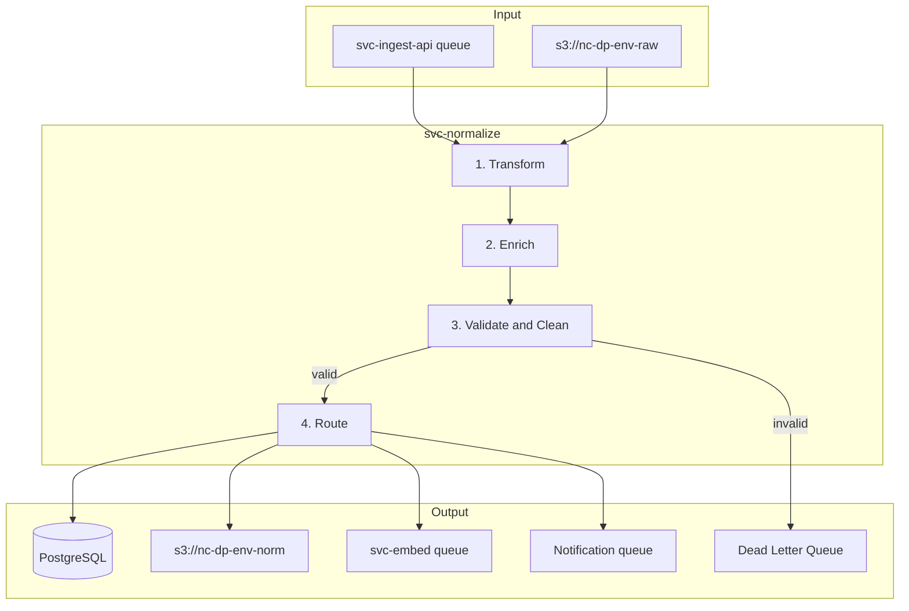

Status: Tier-1 Stub  
Owner: Data Pipeline Engineering  
Approvers: Architecture Board, Data Engineering Lead  
Last updated: 2025-11-26  
Applies to: services/nc-data-pipeline/src/normalize/ (svc-normalize)  
Related: DPS-ING-001, DPS-EMB-001, DCON-001, DM-003, DM-004, ING-003, REF-001, REF-002

-----

## 1. Purpose

This document defines the architecture of svc-normalize, which transforms raw
ingested data into canonical formats, performs enrichment, and prepares data
for embedding and storage.

It exists to:

- Specify the transformation pipeline from raw events to canonical models.
- Define enrichment steps (asset resolution, risk scoring, compliance mapping).
- Establish data quality checks and PII handling.
- Map normalized data to downstream consumers (svc-embed, svc-query-api, AuditHound).

-----

## 2. Scope

This document covers:

- svc-normalize boundaries and responsibilities.
- Transformation logic from source specific to canonical format.
- Enrichment pipeline (asset lookup, risk scoring, compliance tagging).
- Data quality validation and PII detection and redaction.
- Output to svc-embed and primary storage.

This document does not cover:

- Raw ingestion (see DPS-ING-001).
- Vector embedding (see DPS-EMB-001).
- API query layer (see DPS-API-001).

-----

## 3. References

- REF-001 Glossary and Standards Catalog (§8 Data Classification, §8.1 PII Tiers, §8.2 Detection)
- REF-002 Platform Constants
- DCON-001 Data Contract Specification
- DM-003 Physical Schemas and Storage Map
- ING-003 Enrichment Routing and Persistence

-----

## 4. Service context



-----

## 5. Pipeline stages

### 5.1 Transform

- Parse source specific format (GuardDuty JSON, Config, Security Hub ASFF).
- Map to canonical model (SecurityFinding, CloudAsset per DCON-001).
- Validate against DCON-001 schema.

### 5.2 Enrich

- Resolve asset metadata (tags, owner, region).
- Calculate risk score (severity times exposure times blast radius).
- Map to compliance frameworks (SOC2, ISO, PCI controls).
- Link related findings (same resource, same pattern).

### 5.3 Validate and clean

- Data quality checks (required fields, value ranges).
- PII detection and redaction (per REF-001 §8.1 and §8.2).
- Deduplication (semantic, not just ID based).

### 5.4 Route

- Write to PostgreSQL (primary storage).
- Write to `s3://nc-dp-{env}-norm` (normalized bucket per REF-002).
- Enqueue for svc-embed (embedding queue).
- Notify downstream consumers (AuditHound, dashboards).

-----

## 6. Source transformers

|Source          |Source Format      |Canonical Model|Transformer                       |
|----------------|-------------------|---------------|----------------------------------|
|AWS GuardDuty   |GuardDuty JSON     |SecurityFinding|`transformers/aws_guardduty.py`   |
|AWS Config      |Config Item JSON   |CloudAsset     |`transformers/aws_config.py`      |
|AWS Security Hub|ASFF JSON          |SecurityFinding|`transformers/aws_security_hub.py`|
|AWS CloudTrail  |CloudTrail JSON    |SecurityEvent  |`transformers/aws_cloudtrail.py`  |
|GCP SCC         |SCC Finding JSON   |SecurityFinding|`transformers/gcp_scc.py`         |
|Azure Defender  |Defender Alert JSON|SecurityFinding|`transformers/azure_defender.py`  |

Each transformer implements:

```python
class BaseTransformer(ABC):
    @abstractmethod
    def transform(self, raw_event: dict) -> SecurityFinding | CloudAsset | SecurityEvent:
        """Transform source specific format to canonical model."""
        pass
    
    @abstractmethod
    def supports(self, source_type: str) -> bool:
        """Check if this transformer handles the given source type."""
        pass
```

-----

## 7. Enrichment pipeline

### 7.1 Asset resolution

```python
async def enrich_asset(finding: SecurityFinding) -> SecurityFinding:
    asset = await asset_cache.get(finding.resource_id)
    if asset:
        finding.asset_tags = asset.tags
        finding.asset_owner = asset.owner
        finding.asset_environment = asset.environment  # prod, stg, dev
    return finding
```

### 7.2 Risk scoring

```python
def calculate_risk_score(finding: SecurityFinding) -> float:
    """
    Risk = Severity * Exposure * Blast Radius
    
    Severity: CRITICAL=1.0, HIGH=0.8, MEDIUM=0.5, LOW=0.2, INFO=0.1
    Exposure: Public=1.0, Internal=0.5, Private=0.2
    Blast Radius: Prod=1.0, Stg=0.5, Dev=0.2
    """
    severity_weight = SEVERITY_WEIGHTS[finding.severity]
    exposure_weight = get_exposure_weight(finding)
    blast_radius_weight = get_blast_radius_weight(finding)
    
    return severity_weight * exposure_weight * blast_radius_weight
```

### 7.3 Compliance mapping

```python
COMPLIANCE_MAPPINGS = {
    "public_s3_bucket": ["SOC2-CC6.1", "ISO27001-A.9.4.1", "PCI-DSS-7.1"],
    "unencrypted_ebs": ["SOC2-CC6.7", "ISO27001-A.10.1.1", "HIPAA-164.312(a)(2)(iv)"],
    "root_account_used": ["SOC2-CC6.2", "ISO27001-A.9.2.3", "PCI-DSS-8.1.1"],
}
```

This enables AuditHound to consume findings with pre-mapped control references.

-----

## 8. PII handling (per REF-001 §8.1 and §8.2)

|PII Level|Scope                      |Handling in svc-normalize|
|---------|---------------------------|-------------------------|
|P0       |Secrets, private keys      |Reject, never persist    |
|P1       |Highly sensitive (SSN, PCI)|Hash or tokenize         |
|P2       |Standard PII (email, name) |Pseudonymize or slugify  |
|P3       |Public metadata            |Allowed raw              |

Detection and redaction automation:

```python
from nc_models.pii import detect_pii_level, hash_value, tokenize_value

def apply_pii_masking(finding: SecurityFinding) -> SecurityFinding:
    """Apply PII masking per REF-001 §8.2."""
    for field in finding.pii_candidate_fields:
        level = detect_pii_level(getattr(finding, field))
        if level == "P0":
            raise PIIRejectionError(f"P0 data detected in {field}")
        elif level == "P1":
            setattr(finding, field, hash_value(getattr(finding, field)))
        elif level == "P2":
            setattr(finding, field, tokenize_value(getattr(finding, field)))
    return finding
```

-----

## 9. Data quality checks

|Check                       |Action on Failure                  |
|----------------------------|-----------------------------------|
|Required fields missing     |Reject to dead letter              |
|Invalid enum value          |Reject to dead letter              |
|Future timestamp            |Adjust to current time, log warning|
|Duplicate finding (semantic)|Merge or skip, log                 |

Errors follow RFC 7807 Problem Details (REF-001 §10.2).

-----

## 10. Output contracts

### 10.1 To PostgreSQL

Normalized findings written to `security_findings` table (see DM-003).

### 10.2 To svc-embed queue (CloudEvents 1.0 per REF-001 §11)

```json
{
  "id": "018fa0b8-6cde-7d2a-bd7f-8d9a3f6f1d0a",
  "source": "svc.normalize",
  "type": "normalize.finding.enriched.v1",
  "specversion": "1.0",
  "time": "2025-11-26T18:00:00Z",
  "datacontenttype": "application/json",
  "data": {
    "finding_id": "018fa0b8-6cde-7d2a-bd7f-8d9a3f6f1d0a",
    "tenant_id": "tenant_abc123",
    "text_for_embedding": "Public S3 bucket detected with world-readable ACL",
    "severity": "HIGH",
    "compliance_mappings": ["SOC2-CC6.1", "ISO27001-A.9.4.1"]
  }
}
```

### 10.3 To notification queue (CloudEvents 1.0)

```json
{
  "id": "018fa0b8-6cde-7d2a-bd7f-8d9a3f6f1d0b",
  "source": "svc.normalize",
  "type": "normalize.finding.created.v1",
  "specversion": "1.0",
  "time": "2025-11-26T18:00:00Z",
  "datacontenttype": "application/json",
  "data": {
    "event_type": "finding.created",
    "finding_id": "018fa0b8-6cde-7d2a-bd7f-8d9a3f6f1d0a",
    "tenant_id": "tenant_abc123",
    "severity": "HIGH"
  }
}
```

-----

## 11. Storage (per REF-002)

|Type               |Location               |Encryption              |
|-------------------|-----------------------|------------------------|
|Normalized findings|PostgreSQL             |`alias/nc-dp-data-{env}`|
|Normalized files   |`s3://nc-dp-{env}-norm`|`alias/nc-dp-data-{env}`|
|Dead letter        |SQS DLQ                |`alias/nc-dp-data-{env}`|

-----

## 12. Observability (per REF-001 §12)

### 12.1 Logs

JSON structured logs with required keys:

```json
{
  "ts": "2025-11-26T18:00:00Z",
  "level": "INFO",
  "svc": "svc-normalize",
  "env": "prod",
  "adr_id": "ADR-0001",
  "release": "v0.1.0",
  "trace_id": "abc123",
  "span_id": "def456",
  "msg": "Finding normalized successfully",
  "tenant_id": "tenant_abc123",
  "finding_id": "018fa0b8-6cde-7d2a-bd7f-8d9a3f6f1d0a",
  "source_type": "aws_guardduty",
  "risk_score": 0.8
}
```

### 12.2 Metrics

Naming per REF-001 §12.2: `svc.normalize.{metric}`

- `svc.normalize.events_processed_total` (counter)
- `svc.normalize.events_rejected_total` (counter)
- `svc.normalize.latency_seconds` (histogram)
- `svc.normalize.pii_detections_total` (counter by level)
- `svc.normalize.risk_score` (histogram)

-----

## 13. Scalability

|Concern        |Design                           |
|---------------|---------------------------------|
|High throughput|Async workers, batch processing  |
|Variable load  |Auto scaling based on queue depth|
|Slow enrichment|Parallel enrichment with timeouts|
|Large findings |Chunked processing, streaming    |

Target throughput: 10,000 findings per minute at scale.

-----

## 14. Required resource tags (per REF-002)

```json
{
  "Project": "Neurocipher",
  "Service": "svc-normalize",
  "Env": "prod",
  "Owner": "team-platform",
  "Compliance": "SOX|GDPR",
  "DataClass": "Confidential",
  "PII": "true"
}
```

-----

## 15. Acceptance criteria

This document is complete when:

- [ ] All source transformers are implemented for P0 sources (AWS Config, CloudTrail).
- [ ] Risk scoring algorithm is validated by Security team.
- [ ] Compliance mappings cover SOC2 and ISO27001 (AuditHound MVP).
- [ ] PII detection tested with synthetic data per REF-001 §8.2.
- [ ] Output contracts match CloudEvents 1.0 (REF-001 §11).
- [ ] Logs include all required keys (REF-001 §12.1).
- [ ] Service name matches REF-002 constants.
- [ ] Storage locations match REF-002 constants.

-----

## 16. Open questions

- [ ] Confirm compliance mapping is static or configurable per tenant.
- [ ] Define handling for findings that do not map to any compliance control.
- [ ] Define SLA for normalization latency (p99 less than 5s).

-----

## 17. Revision history

|Date      |Author                   |Change             |
|----------|-------------------------|-------------------|
|2025-11-26|Data Pipeline Engineering|Initial Tier-1 stub|